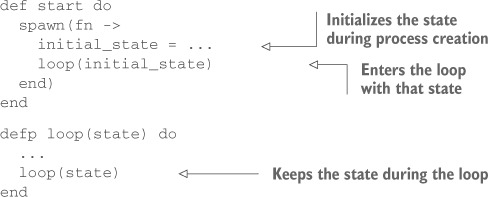
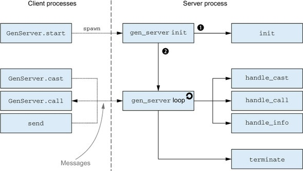

# iexSmix
A new journey of hello world - Learning Elixir
## Books & Courses

- [Getting Started - Elixir](https://elixir-lang.org/getting-started/introduction.html)
- [Crash Course on Elixir](https://elixir-lang.org/crash-course.html)

## Random Topics
- [Pattern Matching - JoyofElixir.com](https://joyofelixir.com/6-pattern-matching/)
- [Map with fat arrow vs colon (Poison - JSON Decode)](https://stackoverflow.com/questions/39340611/map-with-fat-arrow-vs-colon-poison-json-decode)

## Closures

A lambda can reference any variable from the outside scope:


As long as you hold the reference to my_lambda, the variable outside_var is also accessible. This is also known as closure: by holding a reference to a lambda, you indirectly hold a reference to all variables it uses, even if those variables are from the external scope.

A closure always captures a specific memory location. Rebinding a variable doesn’t affect the previously defined lambda that references the same symbolic name:

## Higher Level Types

- Range
- Keyword
- HashDict
- HashSet -> MapSet

## Elixir Runtime

**Note:** The important thing to remember from this discussion is that at runtime, module names are atoms. And somewhere on the disk is an xyz.beam file, where xyz is the expanded form of an alias (such as Elixir.MyModule when the module is named MyModule).

## Elixir Commands

-Switch path (-pa)
> $ iex -pa my/code/path -pa another/code/path
-You can check which code paths are used at runtime by calling the Erlang function
> :code.get_path

## Pure Erlang Modules

In Erlang, modules also correspond to atoms. Somewhere on the disk is a file named code.beam that contains the compiled code of the :code module. Erlang uses simple filenames, which is the reason for this call syntax. But the rules are the same as with Elixir modules. In fact, Elixir modules are nothing more than Erlang modules with fancier names (such as Elixir.MyModule).

e.g. `:code.get_path`

```elixir
defmodule :my_module do
  ...
end
```

## Dynamically calling functions

Kernel.apply/3 function receives three arguments: the module atom, the function atom, and the list of arguments passed to the function. Together, these three arguments, often called **MFA** (for module, function, arguments),

> iex(1)> apply(IO, :puts, ["Dynamic function call."])

Dynamic function call

## Running Scripts

If you don’t want a BEAM instance to terminate, you can provide the `--no-halt` parameter:

> $ elixir --no-halt script.exs

This is most often useful if your main code (outside a module) just starts concurrent tasks that perform all the work.

## Summary of chapter 2

- Elixir code is divided into modules and functions.
- Elixir is a dynamic language. The type of a variable is determined by the value it holds.
- Data is immutable—it can’t be modified. A function can return the modified version of the input that resides in another memory location. - The modified version shares as much memory as possible with the original data.
- The most important primitive data types are numbers, atoms, and binaries.
- There is no boolean type. Instead, the atoms true and false are used.
- There is no nullability. The atom nil can be used for this purpose.
- There is no string type. Instead, you can use either binaries (recommended) or lists (when needed).
- The only complex types are tuples, lists, and maps. Tuples are used to group a small, fixed-size number of fields. Lists are used to     manage variable-size collections. A map is a key-value data structure.
- Range, keyword lists, HashDict, and HashSet are abstractions built on top of the existing data system. They aren’t distinct types.
- Functions are first-class citizens.
- Module names are atoms (or aliases) that correspond to beam files on the disk.
- There are multiple ways of starting programs: iex, elixir, and the mix tool.

## Chapter 3: Control Flow

### 3.2.2. [Guards](./guards.exs)

- A guard can be specified by providing the `when` clause after the arguments list

> Type Ordering number < atom < reference < fun < port < pid < tuple < map < list < bitstring (binary)

### Guards Limitations

The set of operators and functions that can be called from guards is very limited. The following operators and functions are allowed

- Comparison operators (==, !=, ===, !==, >, <, <=, >=)
- Boolean operators (and, or) and negation operators (not, !)
- Arithmetic operators (+, -, *, /)
- <> and ++ as long as the left side is a literal
- `in` operator
- Type-check functions from the Kernel module (for example, is_number/1, is_atom/1, and so on)
- Additional Kernel function abs/1, bit_size/1, byte_size/1, div/2, elem/2, hd/1, length/1, map_size/1, node/0, node/1, rem/2, round/1, self/0, tl/1, trunc/1, and tuple_size/1
- [Code](./guard-limitation.exs)

### Multiclause Lambdas (Annonymous Functions)

```elixir

iex(1)> double = fn(x) -> x*2 end  <--------------- Defines a lambda
iex(2)> double.(3) <------------------ Calls a lambda

```

**Syntax**

```elixir

fn
    pattern_1 ->
      ... (Execuated if pattern_1 matches)
    pattern_1 ->
      ... (Execuated if pattern_2 matches)

    ...
end

```
[Code Sample](./multiclause-lambdas)

### Conditionals

#### Branching with Multiclause Functions

  ```elixir
    defmodule TestList do
      def empty?([]), do: true
      def empty?([_|_]), do: false
    end
  ```

  *Description*: The first clause matches the empty list, whereas the second clause relies on the [head | tail] representation of a non-empty list.

We can implement `Polymorphic Functions` e.g.

  ```elixir
    iex(1)> defmodule Polymorphic do
              def double(x) when is_number(x), do: 2 * x

              def double(x) when is_binary(x), do: x <> x
            end

    iex(2)> Polymorphic.double(3) // 6

    iex(3)> Polymorphic.double("Jar") //"JarJar"

  ```

*Recursive Functions*: Calculate factorial

  ```elixir
    defmodule FactorialFind do
      def fact(0), do: 1
      def fact(x), do: n * fact(n-1)
    end
  ```

**File Line Counter**

```elixir
  defmodule LinesCounter do
    def line_reader(path) do
      File.reader(path)
      |> line_num
    end

    defp line_num({:ok, contents}) do
      contents
      |> String.split("\n")
      length
    end

    defp line_num(error), do: error

  end
```

### Classical branching constructs

- `if` macro Syntax:

  ```exlixir
    if condition do
        ...
    else
        ...
    end
  ```

  e.g.

  ```elixir
    def max(a, b) do
      if a >= b do
        a
      else
        b
      end
    end
  ```

  OR concise `if` macro Syntax:

  ```elixir
    if condition, do: something, else: another_thing
  ```
  
  e.g.

  ```elixir
    def max(a, b) do
      if a >=b, do: a, else: b
    end
  ```

- `unless` macro Syntax:

  ```elixir
    def max(a, b) do
      unless a >= b, do: b, else: a
    end
  ```

- `Cond` macro Syntax:

  ```elixir
    cond do
      expression_1 ->
        ...
      expression_2 ->
        ...
      ...
    end
  ```

  e.g.

  ```elixir
    def max(a, b) do
      cond do
        a >=b -> a
        true -> b
      end
    end
  ```

- `Case` macro Syntax

  ```elixir
    case expression do
      pattern_1 ->
        ...
      pattern_2 ->
        ...
      ...
      # default clause that always matches
      _ -> ....
    end
  ```

  e.g.

  ```elixir
    def max(a, b) do
      case a >= b do
        true -> a
        false -> b
      end
    end
  ```

  **Note**: Multiclauses offer a more `declarative` feel of branching, but they require defining a separate function and passing all the necessary arguments to it. Classical constructs like if or case seem more `imperative` but can often prove simpler than the multiclause approach.

### 3.4.1 Loops and Iterations (Declarative)

- Calculating the sum of the list (sum_list.ex)

  ```elixir
    defmodule ListHelper do
      def sum([]), do: 0

      def sum([head | tail]) do
        head + sum(tail)
      end
    end
  ```

- Print n times natural numbers

  ```elixir
    defmodule NaturalNumber do
      def print(0), do: IO.puts(0)
      def print(1), do: IO.puts(1)

      def print(n) do
        print(n - 1)
        IO.puts(n)
      end
    end
  ```

### 3.4.2. Tail function calls (Procedural)

**Tail-Recursive**: A tail-recursive function—that is, a function that calls itself at the very end—can virtually run forever without consuming additional memory.

```elixir
  def original_fun(...) do
    another_fun(...) <------------- Tail Call (other function or self)
  end
```

**Note**: *Elixir (or, more precisely, Erlang) treats tail calls in a specific manner by performing a tail-call optimization. In this case, calling a function doesn’t result in the usual `stack push`. Instead, something more like a `goto` or a `jump statement` happens. You don’t allocate additional stack space before calling the function, which in turn means the tail function call consumes no additional memory.*

Tail-recursive sum of the first n natural numbers (sum_list_tc.ex)

```elixir
  defmodule ListHelper do
    def sum(list) do
      do_sum(0, list)
    end

    defp do_sum(current_sum, []) do
      current_sum
    end

    defp do_sum(current_sum, [head | tail]) do
      new_sum = head + current_sum
      do_sum(new_sum, tail)
    end
  end
```

Recursive function can also be implemented as

```elixir
  defp do_sum(current_sum, [head | tail]) do
    head + current_sum
    |> do_sum(tail)
  end
```

**Practice Questions**:

- list_len/1 function that calculates the length of a list

- range/2 function that takes two integers: from and to and returns a list of all numbers in a given range

- positive/1 function that takes a list and returns another list that contains only positive numbers from the input list

[View Code](./practice-recursive.exs)

### 3.4.3 Higher-order functions

A `higher-order` function is a fancy name for a function that takes function(s) as its input and/or returns function(s). The word function here means `function value`. `Enum.each/2` is an example of `HOF`.

```elixir
  Enum.each(
    [12,5,5,6],
    fn(x) -> IO.puts(x) end            <-------- Passing a function value to another function
  )
```

### Enumerables

In Elixir, an enumerable is any data type that implements the Enumerable protocol. Lists (`[1, 2, 3]`), Maps (`%{foo: 1, bar: 2}`) and Ranges (`1..3`) are common data types used as enumerables

**[Quick Link](https://hexdocs.pm/elixir/Enum.html)**

- `Enum.sum`

  ```elixir
    iex> Enum.sum([1, 2, 3])
    6

    iex> Enum.sum(1..3)
    6
  ```

- `Enum.filter`

  > filter(enumerable, (element() -> as_boolean(term()))) :: list()
  
  `filter` is not capable of filtering and transforming an element at the same time

  ```elixir
    Enum.filter([1, 2, 3], fn x -> rem(x, 2) == 0 end)
  ```

- `Enum.find(enumerable, default \\ nil, fun)`

  > find(t(), default(), (element() -> any())) :: element() | default()

  ```elixir
    iex> Enum.find([2, 3, 4], fn x -> rem(x, 2) == 1 end)
    3

    iex> Enum.find([2, 4, 6], fn x -> rem(x, 2) == 1 end)
    nil
    iex> Enum.find([2, 4, 6], 0, fn x -> rem(x, 2) == 1 end)
    0
  ```

- `Enum.find_index(enumerable, fun)`

  > find_index(t(), (element() -> any())) :: non_neg_integer() | nil

  ```exlixir
    iex> Enum.find_index([2, 4, 6], fn x -> rem(x, 2) == 1 end)
    nil

    iex> Enum.find_index([2, 3, 4], fn x -> rem(x, 2) == 1 end)
    1
  ```

- `Enum.map`

  ```elixir
    iex> Enum.map([1, 2, 3], fn x -> x * 2 end)
    [2, 4, 6]

    iex> Enum.map(1..3, fn x -> x * 2 end)
    [2, 4, 6]

    iex> map = %{"a" => 1, "b" => 2}
    iex> Enum.map(map, fn {k, v} -> {k, v * 2} end)
    [{"a", 2}, {"b", 4}]

  ```

- `Enum.flat_map(enumerable, fun)`

  > flat_map(t(), (element() -> t())) :: list()

  ```elixir
    iex> Enum.flat_map([:a, :b, :c], fn x -> [x, x] end)
      [:a, :a, :b, :b, :c, :c]

    iex> Enum.flat_map([{1, 3}, {4, 6}], fn {x, y} -> x..y end)
      [1, 2, 3, 4, 5, 6]

    iex> Enum.flat_map([:a, :b, :c], fn x -> [[x]] end)
      [[:a], [:b], [:c]]  
  ```elixir

  ```exlixir
    strings = ["1234", "abc", "12ab"]

    Enum.flat_map(strings, fn string ->
      case Integer.parse(string) do
        # transform to integer
        {int, _rest} -> [int]
        # skip the value
        :error -> []
      end
    end)

    # [1234, 12]
  ```

- `Enum.reduce(enumerable, fun)`

  > reduce(t(), (element(), acc() -> acc())) :: acc()

  ```elixir
    Enum.reduce([1, 2, 3, 4], fn x, acc -> x * acc end)
  ```

- `Enum.reduce(enumerable, acc, fun)`

  > reduce(t(), any(), (element(), any() -> any())) :: any()

  ```elixir
    Enum.reduce([1, 2, 3], 0, fn x, acc -> x + acc end)
  ```

  **Reduce as a building block**

  Reduce (sometimes called `fold`) is a basic building block in functional programming. Almost all of the functions in the Enum module can be implemented on top of reduce. Those functions often rely on other operations, such as Enum.`reverse/1`, which are optimized by the runtime.

  ```elixir
  def my_map(enumerable, fun) do
    enumerable
    |> Enum.reduce([], fn x, acc -> [fun.(x) | acc] end)
    |> Enum.reverse()
    end
  ```

### Comprehensions

### Streams

Streams are a `special` kind of enumerables that can be useful for doing lazy composable operations over anything enumerable. A stream is a `lazy enumerable`, which means it produces the actual result on demand.

```elixir

 iex(1)> streams = [1,2,3] |>
            Stream.map(fn x -> x*2 end)

  #Stream<[enum: [1, 2, 3], funs: [#Function<48.35876588/1 in Stream.map/2>]]>


iex(2)> Enum.to_list(streams)
  [1, 4, 9]
```

**Employee Example**:

```elixir
  iex(1)> ["A", "B", "C"] |>
          Stream.with_index |>
          Enum.each(
            fn ({emp, index}) ->
              IO.puts "#{index + 1}. #{emp}"
          end)
  1. A
  2. B
  3. C
```

**Find SQRT**:

```elixir
  iex(1)> [9, -1, "foo", 25, 49]                                    |>
          Stream.filter(&(is_number(&1) and &1 > 0))                |>
          Stream.map(&{&1, :math.sqrt(&1)})                         |>
          Stream.with_index                                         |>
          Enum.each(
              fn({{input, result}, index}) ->
                IO.puts "#{index + 1}. sqrt(#{input}) = #{result}"
              end
            )

  1. sqrt(9) = 3.0
  2. sqrt(25) = 5.0
  3. sqrt(49) = 7.0
```

### Practice Questions

Using large_lines!/1 as a model, write the following function:

- lines_lengths!/1 that takes a file path and returns a list of numbers, with each number representing the length of the corresponding line from the file.
- longest_line_length!/1 that returns the length of the longest line in a file.
- longest_line!/1 that returns the contents of the longest line in a file.
- words_per_line!/1 that returns a list of numbers, with each number representing the word count in a file. Hint: to get the word count of a line, use length(String.split(line)).

### Summary of Chapter 3

- Pattern matching is a construct that attempts to match a right-side term to the left-side pattern. In the process, variables from the pattern are bound to corresponding subterms from the term. If a term doesn’t match the pattern, an error is raised.
- Function arguments are patterns. Calling a function tries to match the provided values to the patterns specified in the function definition.
Functions can have multiple clauses. The first clause that matches all the arguments is executed.
- Multiclause functions are a primary tool for conditional branching, with each branch written as a separate clause. Less often, classical constructs such as if, unless, cond, and case are used.
- Recursion is the main tool for implementing loops. Tail recursion is used when you need to run an arbitrarily long loop.
- Higher-order functions make writing loops much easier. There are many useful generic iteration functions in the Enum module. The Stream module additionally makes it possible to implement lazy and composable iterations.
- Comprehensions can also be used to iterate, transform, filter, and join various enumerables.

## Chapter 4. Data Abstractions

### Principles of Data Abstraction

- A module is in charge of abstracting some data.
- The module’s functions usually expect an instance of the data abstraction as the first argument.
- Modifier functions return a modified version of the abstraction.
- `Query functions` return some other type of data.

**[Simple TodoList](./todo_list)**

### Abstraction using Struct

- Define a Struct

  ```elixir
    defmodule Fraction do
      defstruct a: nil, b: nil

      ...
    end
  ```

- Instantiate a Struct

  ```elixir
    iex(1)> one_half = %Fraction{a: 1, b: 2}
    %Fraction{a: 1, b: 2}
  ```

- Pattern matching with Struct

  ```elixir
    iex(1)> %Fraction{a: a, b: b} = one_half
    %Fraction{a: 1, b: 2}
  ```

- Updating Struct

  ```elixir
    iex(1)> one_quarter = %Fraction{one_half | b: 4}
    %Fraction{a: 1, b: 4}
  ```

**[Check Fraction](./practice/fraction.ex)**

### Struct vs Maps

- Struct are also maps
- You can't perform enumerable function over struct
- Struct pattern can't match a plain map

  ```elixir
    iex(1)> %Fraction{} = %{a: 1, b: 2}
    ** (MatchError) no match of right hand side value: %{a: 1, b: 2}
  ```

- A plan map pattern can match a struct

  ```elixir
    iex(1)> %{a: a, b: b} = %Fraction{a: 1, b: 2}
    %Fraction{a: 1, b: 2}
  ```

### Records

This is a facility that let’s you use tuples and still be able to access individual elements by name. Records can be defined using the `defrecord` and `defrecordp` macros from the Record

### Data Transparency

The benefit of data transparency is that the data can be easily inspected, which can be useful for debugging purposes.

- `inspect function`

  ```elixir
    iex(2)> IO.puts(inspect(todo_list, structs: false))

    %{__struct__: HashDict, root: {[], [], [],
      [{2013, 12, 19}, %{date: {2013, 12, 19}, title: "Dentist"}],
      [], [], [], []}, size: 1}
  ```

- `IO.inspect`

  ```elixir
    iex(1)> Fraction.new(1, 4) |>
            IO.inspect |>
            Fraction.add(Fraction.new(1, 4)) |>
            IO.inspect |>
            Fraction.add(Fraction.new(1, 2)) |>
            IO.inspect |>
            Fraction.value
  ```

### 4.2 Working with hierarchical data

- Iterative updates

Iteratively building the to-do list

  ```elixir
    defmodule TodoList do

      # ...

      def new (entries // []) do
        Enum.reduce(
          entries,
          %TodoList{},
          fn(entry, todo_list_acc) ->
            add_entry(todo_list_acc, entry)
          end
        )
      end

      # ...

    end
  ```

OR you can make more simple by doing `capture operator(&)`

  ```elixir
    def new (entries // []) do
      Enum.reduce(
        entries,
        %TodoList{},
        &add_entry(&2, &1)
      )
    end
  ```

### Exercise: importing from a file

Task is to create TodoList.`CsvImporter.import("todos.csv")`

**Steps:**

- Open a file and go through it, removing \n from each line. Hint: use File.stream!/1, Stream.map/2, and String.replace/2. You did this in chapter 3, when we talked about streams, in the example where you filtered lines longer than 80 characters.

- Parse each line obtained from the previous step into a raw tuple in the form {{year, month, date}, title}. Hint: you have to split each line using String.split/2. Then further split the first element (date), and extract the date parts. String.split/2 returns a list of strings separated by the given token. When you split the date field, you’ll have to additionally convert each date part into a number. Use String.to_integer/1 for this.

- Once you have the raw tuple, create a map that represents the entry.

- The output of step 3 should be an enumerable that consists of maps. Pass that enumerable to the `TodoList.new/1` function that you recently implemented.

### Polymorphism with protocols

Polymorphism is a runtime decision about which code to execute, based on the nature of the input data. In Elixir, the basic (but not the only) way of doing this is by using the language feature called `protocols`.

```elixir
  Enum.each([1, 2, 3], &IO.puts/1)
  Enum.each(1..3, &IO.puts/1)
  Enum.each(hash_dict, &IO.puts/1)
```

#### Protocol Basics

A `protocol` is a module in which you declare functions without implementing them. Consider it a rough equivalent of an OO interface. The generic logic relies on the protocol and calls its functions. Then you can provide a concrete implementation of the protocol for different data types.

The protocol `String.Chars` is provided by the Elixir

```elixir
  defprotocol String.Chars do # Defination of the protocol
    def to_string(anything) # Declaration of protocol functions
  end
```

Elixir already implements the protocol for atoms, numbers, and some other data types.

```elixir
  iex(1)> String.Chars.to_string(1)
  "1"
  iex(2)> String.Chars.to_string(:an_atom)
  "an_atom"
```

There is generic code that relies on the protocol. In the case of String.Chars, this is the auto-imported function `Kernel.to_string/1`:

```elixir
  iex(4)> to_string(1)
  "1"

  iex(5)> to_string(:an_atom)
  "an_atom"
```

#### Implementing a protocol

The following snippet implements `String.Chars` for integers:

```elixir
  defimpl String.Chars, for: Integer do
    def to_string(thing) do
      Integer.to_string(thing)
    end
  end
```

Implementing String.Chars protocol for TodoList

```elixir
  defimpl String.Chars, for: TodoList do

    def to_string(_) do
      "#TodoList"
    end
  end
```

### Collectable to-do list

To make the abstraction collectable, you have to implement the corresponding protocol

```elixir
  defimpl Collectable, for: ExampleTodoList do
    def into(original) do
      {original, &into_callback/2}
    end

    defp into_callback(todo_list, {:cont, entry}) do
      TodoList.add_entry(todo_list, entry)
    end

    defp into_callback(todo_list, :done), do: todo_list
    defp into_callback(todo_list, :halt), do: :ok
  end
```

Let’s see this in action. Copy/paste the about code into the shell, and then try the following:

```elixir

iex(1)> entries = [
  %{date: {2013, 12, 19}, title: "Dentist"},
  %{date: {2013, 12, 19}, title: "Painter"},
  %{date: {2014, 12, 19}, title: "Shopkeeper"}
]

iex(2)> for entry <- entries, into: TodoList.new, do: entry # collecting into a TodoList

```

### 4.4 Summary

- A module is used to create a data abstraction. A module’s functions create, manipulate, and query data. Clients can inspect the entire structure but shouldn’t rely on it.
- Maps can be used to group different fields together in a single structure.
- Structs are special kind of maps that allow you to define data abstractions related to a module.
- Polymorphism can be implemented with protocols. A protocol defines an interface that is used by the generic logic. You can then provide specific protocol implementations for a data type.

# The Platform

## Chapter 5. Concurrency Primitives

This chapter covers

- Understanding BEAM concurrency principles
- Working with processes
- Working with stateful server processes
- Runtime considerations

### Concurrency Principles

To make your system highly available, you have to tackle following challenges:

- Minimize, isolate, and recover from the effects of runtime errors (`fault tolerance`).
- Handle a load increase by adding more hardware resources without changing or redeploying the code (`scalability`).
- Run your system on multiple machines so that others can take over if one machine crashes(`distribution`)

### Working with processes

The benefits of processes are most obvious when you want to run something concurrently and parallelize the work as much as possible

**Concurrency vs Parallelism:**

#### Creating processes

To create a process, you can use the auto-imported `spawn/1` (takes a lambda function) function:

```elixir
  spawn( fn ->
    expression_1
    ---
    expression_n
  )

```

e.g.

```elixir

iex(1)> run_query = fn(query_def) ->
        :timer.sleep(2000)
        "#{query_def} result"
        end
iex(2)> async_query = fn(query_def) ->
        spawn(fn -> IO.puts(run_query(query_def))) end)
        end
iex(3)> async_query.("Hello World of Spwans")
iex(4)> Enum.each(1..5, &async_query.("query - #{ &1 }"))
```

#### Message passing

To send a message to a process, you need to have access to its process identifier (pid). Recall from the previous section that the pid of the newly created process is the result of the `spawn/1` function. In addition, you can obtain the pid of the current process by calling the auto-imported self/1 function.

```elixir
  send_message = fn(shell_pid, message) ->
    :timer.sleep(10000)
    send(shell_pid, message)
  end

  async_send = fn(shell_pid, message) ->
    spawn(fn -> send_message.(shell_pid, message) end)
  end

  async_send = fn(shell_pid, message) ->
    spawn(fn -> send_message.(shell_pid, message) end)
  end

  # receive waits indefinitely for a new message to arrive
  check_message = fn ->
    receive do
      {:Y, x } -> x + 5
      after 4000 -> "Message didn't receive yet" # terminate receive block
    end
  end
```

Now run this on shell

```elixir

iex(1)> async_send(self, {:Y, 10})
iex(2)> check_message.()
```

**Working of `receive` construct**:

The receive construct works as follows:

- Take the first message from the mailbox.

- Try to match it against any of the provided patterns, going from top to bottom.

- If a pattern matches the message, run the corresponding code.

- If no pattern matches, put the message back into the mailbox at the same position it originally occupied. Then try the next message.

- If there are no more messages in the queue, wait for a new one to arrive. When a new message arrives, start from step 1, inspecting the first message in the mailbox.

- If the after clause is specified and no message arrives in the given amount of time, run the code from the after block

#### Synchronous Sending

Achieving synchronous message sending using asynchronous way by using process id to inform the caller and receiver what's going on.

```elixir
  send_message = fn(shell_pid, message) ->
    :timer.sleep(1000)
    send(shell_pid, {:query_result, message})
  end

  async_send = fn(message) ->
    caller = self
    spawn(fn -> send_message.(caller, message) end)
  end
```

#### 5.3. Stateful server processes

Stateful server processes resemble objects. They maintain state and can interact with other processes via messages. But a process is concurrent, so multiple server processes may run in parallel.

A simple server function that runs forever:

```elixir

defmodule Database do
  def start do
    spawn(&loop/0) # start the loop concurrently
  end

  defp loop do
    receive do
    ...   # handle message
    end

    loop # keeps the looping
  end

  ...

end
```

When implementing a server process, it usually makes sense to put all of its code in a single module. The functions of this module generally fall in two categories: interface and implementation.

- `Interface` functions are public and are executed in the caller process. They hide the details of process creation and the communication protocol.

- `Implementation` functions are usually private and run in the server process.

Complete implementation of server process:

```elixir

defmodule DatabaseServer do

  def start do
    spawn(&loop/0) # start the loop concurrently
  end

  defp loop do
    receive do
      {:run_query, caller, query_def} ->
      query_res  = run_query(query_def)
      send(caller, {:query_result, query_res})
    end
    loop # keeps looping
  end

  defp run_query(query_def) do
    :timer.sleep(2000)
    "#{query_def} result"
  end

  def run_async(server_pid, query_def) do
    send(server_pid, {:run_query, self, query_def})
  end

  def get_result do
    receive do
     {:query_result, result } -> result
    after 5000 ->
     {:error, :timeout}
  end
end
```

#### Keeping a process state

Here's the basic sketch:



Extending database server to use connection handle

```elixir
defmodule DatabaseServer do

  def start do
    spawn(fn ->
      initial_state = :random.uniform(1000)
      loop(initial_state)
    end) # start the loop concurrently
  end

  defp loop(connection) do
    receive do
      {:run_query, from_pid, query_def} ->
      query_res  = run_query(connection, query_def)
      send(from_pid, {:query_result, query_res})
    end
    loop(connection) # keeps looping
  end

  defp run_query(connection, query_def) do
    :timer.sleep(2000)
    "#{connection}: #{query_def} result"
  end

  def run_async(server_pid, query_def) do
    send(server_pid, {:run_query, self, query_def})
  end

  def get_result do
    receive do
     {:query_result, result } -> result
    after 5000 ->
     {:error, :timeout}
  end
end
```

#### Mutable State

To show the mutable process state, let's look at the calculator example

```elixir
defmodule Calculator do
  def start do
    # initial state 0
    spawn(fn -> loop(0) end)
  end
  
  defp loop(curr_val) do
    new_val =
      receive do
        message ->
          process_message(curr_val, message)
      end

    loop(new_val)
  end

  def value(server_pid) do
    send(server_pid, {:value, self})

    receive do
      {:response, value} ->
        value
    end
  end

  defp process_message(curr_val, {:value, caller}) do
    send(caller, {:response, curr_val})
    curr_val
  end

  defp process_message(curr_val, {:add, value}) do
    curr_val + value
  end

  defp process_message(curr_val, {:sub, value}) do
    curr_val - value
  end

  defp process_message(curr_val, {:mul, value}) do
    curr_val * value
  end

  defp process_message(curr_val, {:div, value}) do
    curr_val / value
  end

  def add(server_pid, value), do: send(server_pid, {:add, value})
  def sub(server_pid, value), do: send(server_pid, {:sub, value})
  def mul(server_pid, value), do: send(server_pid, {:mul, value})
  def div(server_pid, value), do: send(server_pid, {:div, value})
end
```

**Tidbits:**

- The role of a stateful process is to keep the data available while the system is running. The data should be modeled using pure functional abstractions. A pure `functional structure` provides many benefits, such as `integrity` and `atomicity`. Furthermore, it can be reused in various contexts and tested independently.

#### Registered processes

In order for a process to cooperate with other processes, it must know their whereabouts. In BEAM, a process is identified by the corresponding pid. To make process A send messages to process B, you have to bring the pid of process B to process A. In this sense, a pid resembles a reference or pointer in the OO world.

```elixir
iex(1)> Process.register(self, :proc)
iex(2)> send(:proc, msg)
iex(3)> receive do
          msg -> IO.puts "Hello, #{msg}"
        end
```

The following rules apply to registered processes:

- The process alias can only be an atom.
- A single process can have only one alias.
- Two processes can’t have the same alias.

### Runtime considerations

- Process bottleneck
- Unlimited process mailboxes
- Share no memomery

  the purpose of shared nothing concurrency:

  - First, it simplifies the code of each individual process. Because processes don’t share memory, you don’t need complicated `synchronization` mechanisms such as locks and mutexes.
  - Another benefit is overall `stability`: one process can’t compromise the memory of another. This in turn promotes the `integrity` and fault-tolerance of the system.
  - Finally, shared nothing concurrency makes it possible to implement an efficient garbage collector
- Scheduler inner working

### Chapter 6. Generic server processes

- Building a generic server process
- Using gen_server

Tasks of a server process:

- Spawn a separate process.
- Run an infinite loop in the process.
- Maintain the process state.
- React to messages.
- Send a response back to the caller.

#### Using `gen_server`

Some of the compelling features provided by `gen_server` include the following:

- Support for calls and casts
- Customizable timeouts for call requests
- Propagation of server-process crashes to client processes waiting for a response
- Support for distributed systems

#### OTP behaviours

ServerProcess is a simple example of a behaviour. In Erlang terminology, a behaviour is generic code that implements a common pattern. The generic logic is exposed through the behaviour module, and you can plug into it by implementing a corresponding callback module.

`OTP` ships with a few predefined behaviours:

- `gen_server—Generic` implementation of a stateful server process
- `supervisor`—Provides error handling and recovery in concurrent systems
- `application`—Generic implementation of components and libraries
- `gen_event`—Provides event-handling support
- `gen_fsm`—Runs a finite state machine in a stateful server process

**Note:** the gen_server behaviour requires six callback functions, but frequently you’ll need only a subset of those.

```elixir
defmodule KeyValueStore do
  user GenServer
end

iex(1)> KeyValueStore.__info__(:functions)
[
  child_spec: 1,
  code_change: 3,
  handle_call: 3,
  handle_cast: 2,
  handle_info: 2,
  init: 1,
  terminate: 2
]
```

#### Handling plain messsages

Plain messages can be handle by `GenServer.handle_info` callback

```elixir
handle_info(:cleanup, state) do
  IO.puts "cleaning up process..."
  {:noreply, state}
end

# for any other message
handle_info(_, state), do: {:noreply, state}
```

#### Alias registration of processes

Local registration is an important feature because it supports patterns of fault-tolerance and distributed systems. You’ll see exactly how this works in later chapters, but it’s worth mentioning that you can provide the process alias as an option to `GenServer.start`:

```elixir
GenServer.start(
  CallbackModule,
  init_param,
  name: :some_alias # registering process under an alias
)
```

#### Process life cycle



#### The Actor Model

Erlang is an accidental implementation of the Actor model originally described by Carl Hewitt. An actor is a concurrent computational entity that encapsulates state and can communicate with other actors. When processing a single message, an actor can designate the new state that will be used when processing the next message.

#### 6 Summary

- A generic server process is an abstraction that implements tasks common to any kind of server process, such as recursion-powered looping and message passing.
- A generic server process can be implemented as a behaviour. A behaviour drives the process, whereas specific implementations can plug into the behaviour via callback modules.
- The behaviour invokes callback functions when the specific implementation needs to make a decision.
gen_server is an OTP behaviour that implements a generic server process.
- A callback module for gen_server must implement various functions. The most frequently used ones are init/1, handle_cast/2, handle_call/3, and handle_info/2.
- You can interact with a gen_server process with the GenServer module.
- Two types of requests can be issued to a server process: calls and casts.
  - A cast is a fire-and-forget type of request—a caller sends a message and immediately moves on to do something else.
- A call is a synchronous send-and-respond request—a caller sends a message and waits until the response arrives, the timeout occurs, or the server crashes.

### Chapter 7. Building a concurrent system

This chapter covers

- Working with the mix project
- Managing multiple to-do lists
- Persisting data
- Reasoning with processes

#### Working with `mix` tool

There are no hard rules regarding how files should be named and organized in mix project, but there are some preferred conventions:

- You should place your modules under a common top-level alias. For example, modules might be called `Todo.List`, `Todo.Server`, and so on. - This reduces the chance of module names conflicting when you combine multiple projects into a single system.
- In general, one file should contain one module. Occasionally, if a helper module is small and used only internally, it can be placed in the same file as the module using it. If you want to implement protocols for the module, you can do this in the same file as well.
- A filename should be an underscore (aka `snake`) case of the main module name it implements. For example, a `TodoServer` module resides in a `todo_server.ex` file in the lib folder.
The folder structure should correspond to multipart module names. A module called `Todo.Server` should reside in the file `lib/todo/server.ex`.

