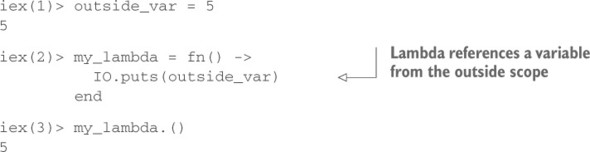

# iexSmix
A new journey of hello world - Learning Elixir
## Books & Courses

- [Getting Started - Elixir](https://elixir-lang.org/getting-started/introduction.html)
- [Crash Course on Elixir](https://elixir-lang.org/crash-course.html)

## Random Topics
- [Pattern Matching - JoyofElixir.com](https://joyofelixir.com/6-pattern-matching/)
- [Map with fat arrow vs colon (Poison - JSON Decode)](https://stackoverflow.com/questions/39340611/map-with-fat-arrow-vs-colon-poison-json-decode)

## Closures

A lambda can reference any variable from the outside scope:



As long as you hold the reference to my_lambda, the variable outside_var is also accessible. This is also known as closure: by holding a reference to a lambda, you indirectly hold a reference to all variables it uses, even if those variables are from the external scope.

A closure always captures a specific memory location. Rebinding a variable doesn’t affect the previously defined lambda that references the same symbolic name:

## Higher Level Types

- Range
- Keyword
- HashDict
- HashSet -> MapSet

## Elixir Runtime

**Note:** The important thing to remember from this discussion is that at runtime, module names are atoms. And somewhere on the disk is an xyz.beam file, where xyz is the expanded form of an alias (such as Elixir.MyModule when the module is named MyModule).

## Elixir Commands

-Switch path (-pa)
> $ iex -pa my/code/path -pa another/code/path
-You can check which code paths are used at runtime by calling the Erlang function
> :code.get_path

## Pure Erlang Modules

In Erlang, modules also correspond to atoms. Somewhere on the disk is a file named code.beam that contains the compiled code of the :code module. Erlang uses simple filenames, which is the reason for this call syntax. But the rules are the same as with Elixir modules. In fact, Elixir modules are nothing more than Erlang modules with fancier names (such as Elixir.MyModule).

e.g. `:code.get_path`

```elixir
defmodule :my_module do
  ...
end
```

## Dynamically calling functions

Kernel.apply/3 function receives three arguments: the module atom, the function atom, and the list of arguments passed to the function. Together, these three arguments, often called **MFA** (for module, function, arguments),

> iex(1)> apply(IO, :puts, ["Dynamic function call."])

Dynamic function call

## Running Scripts

If you don’t want a BEAM instance to terminate, you can provide the `--no-halt` parameter:

> $ elixir --no-halt script.exs

This is most often useful if your main code (outside a module) just starts concurrent tasks that perform all the work.

## Summary of chapter 2

- Elixir code is divided into modules and functions.
- Elixir is a dynamic language. The type of a variable is determined by the value it holds.
- Data is immutable—it can’t be modified. A function can return the modified version of the input that resides in another memory location. - The modified version shares as much memory as possible with the original data.
- The most important primitive data types are numbers, atoms, and binaries.
- There is no boolean type. Instead, the atoms true and false are used.
- There is no nullability. The atom nil can be used for this purpose.
- There is no string type. Instead, you can use either binaries (recommended) or lists (when needed).
- The only complex types are tuples, lists, and maps. Tuples are used to group a small, fixed-size number of fields. Lists are used to     manage variable-size collections. A map is a key-value data structure.
- Range, keyword lists, HashDict, and HashSet are abstractions built on top of the existing data system. They aren’t distinct types.
- Functions are first-class citizens.
- Module names are atoms (or aliases) that correspond to beam files on the disk.
- There are multiple ways of starting programs: iex, elixir, and the mix tool.

## Chapter 3: Control Flow

### 3.2.2. [Guards](./guards.exs)

- A guard can be specified by providing the `when` clause after the arguments list

> Type Ordering number < atom < reference < fun < port < pid < tuple < map < list < bitstring (binary)

### Guards Limitations

The set of operators and functions that can be called from guards is very limited. The following operators and functions are allowed

- Comparison operators (==, !=, ===, !==, >, <, <=, >=)
- Boolean operators (and, or) and negation operators (not, !)
- Arithmetic operators (+, -, *, /)
- <> and ++ as long as the left side is a literal
- `in` operator
- Type-check functions from the Kernel module (for example, is_number/1, is_atom/1, and so on)
- Additional Kernel function abs/1, bit_size/1, byte_size/1, div/2, elem/2, hd/1, length/1, map_size/1, node/0, node/1, rem/2, round/1, self/0, tl/1, trunc/1, and tuple_size/1
- [Code](./guard-limitation.exs)

### Multiclause Lambdas (Annonymous Functions)

```elixir

iex(1)> double = fn(x) -> x*2 end  <--------------- Defines a lambda
iex(2)> double.(3) <------------------ Calls a lambda

```

**Syntax**

```elixir

fn
    pattern_1 ->
      ... (Execuated if pattern_1 matches)
    pattern_1 ->
      ... (Execuated if pattern_2 matches)

    ...
end

```
[Code Sample](./multiclause-lambdas)

### Conditionals

#### Branching with Multiclause Functions

  ```elixir
    defmodule TestList do
      def empty?([]), do: true
      def empty?([_|_]), do: false
    end
  ```

  *Description*: The first clause matches the empty list, whereas the second clause relies on the [head | tail] representation of a non-empty list.

We can implement `Polymorphic Functions` e.g.

  ```elixir
    iex(1)> defmodule Polymorphic do
              def double(x) when is_number(x), do: 2 * x

              def double(x) when is_binary(x), do: x <> x
            end

    iex(2)> Polymorphic.double(3) // 6

    iex(3)> Polymorphic.double("Jar") //"JarJar"

  ```

*Recursive Functions*: Calculate factorial

  ```elixir
    defmodule FactorialFind do
      def fact(0), do: 1
      def fact(x), do: n * fact(n-1)
    end
  ```

**File Line Counter**

```elixir
  defmodule LinesCounter do
    def line_reader(path) do
      File.reader(path)
      |> line_num
    end

    defp line_num({:ok, contents}) do
      contents
      |> String.split("\n")
      length
    end

    defp line_num(error), do: error

  end
```

### Classical branching constructs

- `if` macro Syntax:

  ```exlixir
    if condition do
        ...
    else
        ...
    end
  ```

  e.g.

  ```elixir
    def max(a, b) do
      if a >= b do
        a
      else
        b
      end
    end
  ```

  OR concise `if` macro Syntax:

  ```elixir
    if condition, do: something, else: another_thing
  ```
  
  e.g.

  ```elixir
    def max(a, b) do
      if a >=b, do: a, else: b
    end
  ```

- `unless` macro Syntax:

  ```elixir
    def max(a, b) do
      unless a >= b, do: b, else: a
    end
  ```

- `Cond` macro Syntax:

  ```elixir
    cond do
      expression_1 ->
        ...
      expression_2 ->
        ...
      ...
    end
  ```

  e.g.

  ```elixir
    def max(a, b) do
      cond do
        a >=b -> a
        true -> b
      end
    end
  ```

- `Case` macro Syntax

  ```elixir
    case expression do
      pattern_1 ->
        ...
      pattern_2 ->
        ...
      ...
      # default clause that always matches
      _ -> ....
    end
  ```

  e.g.

  ```elixir
    def max(a, b) do
      case a >= b do
        true -> a
        false -> b
      end
    end
  ```

  **Note**: Multiclauses offer a more `declarative` feel of branching, but they require defining a separate function and passing all the necessary arguments to it. Classical constructs like if or case seem more `imperative` but can often prove simpler than the multiclause approach.

### 3.4.1 Loops and Iterations (Declarative)

- Calculating the sum of the list (sum_list.ex)

  ```elixir
    defmodule ListHelper do
      def sum([]), do: 0

      def sum([head | tail]) do
        head + sum(tail)
      end
    end
  ```

- Print n times natural numbers

  ```elixir
    defmodule NaturalNumber do
      def print(0), do: IO.puts(0)
      def print(1), do: IO.puts(1)

      def print(n) do
        print(n - 1)
        IO.puts(n)
      end
    end
  ```

### 3.4.2. Tail function calls (Procedural)

**Tail-Recursive**: A tail-recursive function—that is, a function that calls itself at the very end—can virtually run forever without consuming additional memory.

```elixir
  def original_fun(...) do
    another_fun(...) <------------- Tail Call (other function or self)
  end
```

**Note**: *Elixir (or, more precisely, Erlang) treats tail calls in a specific manner by performing a tail-call optimization. In this case, calling a function doesn’t result in the usual `stack push`. Instead, something more like a `goto` or a `jump statement` happens. You don’t allocate additional stack space before calling the function, which in turn means the tail function call consumes no additional memory.*

Tail-recursive sum of the first n natural numbers (sum_list_tc.ex)

```elixir
  defmodule ListHelper do
    def sum(list) do
      do_sum(0, list)
    end

    defp do_sum(current_sum, []) do
      current_sum
    end

    defp do_sum(current_sum, [head | tail]) do
      new_sum = head + current_sum
      do_sum(new_sum, tail)
    end
  end
```

Recursive function can also be implemented as

```elixir
  defp do_sum(current_sum, [head | tail]) do
    head + current_sum
    |> do_sum(tail)
  end
```

**Practice Questions**:

- list_len/1 function that calculates the length of a list

- range/2 function that takes two integers: from and to and returns a list of all numbers in a given range

- positive/1 function that takes a list and returns another list that contains only positive numbers from the input list

[View Code](./practice-recursive.exs)

### 3.4.3 Higher-order functions

A `higher-order` function is a fancy name for a function that takes function(s) as its input and/or returns function(s). The word function here means `function value`. `Enum.each/2` is an example of `HOF`.

```elixir
  Enum.each(
    [12,5,5,6],
    fn(x) -> IO.puts(x) end            <-------- Passing a function value to another function
  )
```

### Enumerables

In Elixir, an enumerable is any data type that implements the Enumerable protocol. Lists (`[1, 2, 3]`), Maps (`%{foo: 1, bar: 2}`) and Ranges (`1..3`) are common data types used as enumerables

**[Quick Link](https://hexdocs.pm/elixir/Enum.html)**

- `Enum.sum`

  ```elixir
    iex> Enum.sum([1, 2, 3])
    6

    iex> Enum.sum(1..3)
    6
  ```

- `Enum.filter`

  > filter(enumerable, (element() -> as_boolean(term()))) :: list()
  
  `filter` is not capable of filtering and transforming an element at the same time

  ```elixir
    Enum.filter([1, 2, 3], fn x -> rem(x, 2) == 0 end)
  ```

- `Enum.find(enumerable, default \\ nil, fun)`

  > find(t(), default(), (element() -> any())) :: element() | default()

  ```elixir
    iex> Enum.find([2, 3, 4], fn x -> rem(x, 2) == 1 end)
    3

    iex> Enum.find([2, 4, 6], fn x -> rem(x, 2) == 1 end)
    nil
    iex> Enum.find([2, 4, 6], 0, fn x -> rem(x, 2) == 1 end)
    0
  ```

- `Enum.find_index(enumerable, fun)`

  > find_index(t(), (element() -> any())) :: non_neg_integer() | nil

  ```exlixir
    iex> Enum.find_index([2, 4, 6], fn x -> rem(x, 2) == 1 end)
    nil

    iex> Enum.find_index([2, 3, 4], fn x -> rem(x, 2) == 1 end)
    1
  ```

- `Enum.map`

  ```elixir
    iex> Enum.map([1, 2, 3], fn x -> x * 2 end)
    [2, 4, 6]

    iex> Enum.map(1..3, fn x -> x * 2 end)
    [2, 4, 6]

    iex> map = %{"a" => 1, "b" => 2}
    iex> Enum.map(map, fn {k, v} -> {k, v * 2} end)
    [{"a", 2}, {"b", 4}]

  ```

- `Enum.flat_map(enumerable, fun)`

  > flat_map(t(), (element() -> t())) :: list()

  ```elixir
    iex> Enum.flat_map([:a, :b, :c], fn x -> [x, x] end)
      [:a, :a, :b, :b, :c, :c]

    iex> Enum.flat_map([{1, 3}, {4, 6}], fn {x, y} -> x..y end)
      [1, 2, 3, 4, 5, 6]

    iex> Enum.flat_map([:a, :b, :c], fn x -> [[x]] end)
      [[:a], [:b], [:c]]  
  ```elixir

  ```exlixir
    strings = ["1234", "abc", "12ab"]

    Enum.flat_map(strings, fn string ->
      case Integer.parse(string) do
        # transform to integer
        {int, _rest} -> [int]
        # skip the value
        :error -> []
      end
    end)

    # [1234, 12]
  ```

- `Enum.reduce(enumerable, fun)`

  > reduce(t(), (element(), acc() -> acc())) :: acc()

  ```elixir
    Enum.reduce([1, 2, 3, 4], fn x, acc -> x * acc end)
  ```

- `Enum.reduce(enumerable, acc, fun)`

  > reduce(t(), any(), (element(), any() -> any())) :: any()

  ```elixir
    Enum.reduce([1, 2, 3], 0, fn x, acc -> x + acc end)
  ```

  **Reduce as a building block**

  Reduce (sometimes called `fold`) is a basic building block in functional programming. Almost all of the functions in the Enum module can be implemented on top of reduce. Those functions often rely on other operations, such as Enum.`reverse/1`, which are optimized by the runtime.

  ```elixir
  def my_map(enumerable, fun) do
    enumerable
    |> Enum.reduce([], fn x, acc -> [fun.(x) | acc] end)
    |> Enum.reverse()
    end
  ```

### Comprehensions

### Streams

Streams are a `special` kind of enumerables that can be useful for doing lazy composable operations over anything enumerable. A stream is a `lazy enumerable`, which means it produces the actual result on demand.

```elixir

 iex(1)> streams = [1,2,3] |>
            Stream.map(fn x -> x*2 end)

  #Stream<[enum: [1, 2, 3], funs: [#Function<48.35876588/1 in Stream.map/2>]]>


iex(2)> Enum.to_list(streams)
  [1, 4, 9]
```

**Employee Example**:

```elixir
  iex(1)> ["A", "B", "C"] |>
          Stream.with_index |>
          Enum.each(
            fn ({emp, index}) ->
              IO.puts "#{index + 1}. #{emp}"
          end)
  1. A
  2. B
  3. C
```

**Find SQRT**:

```elixir
  iex(1)> [9, -1, "foo", 25, 49]                                    |>
          Stream.filter(&(is_number(&1) and &1 > 0))                |>
          Stream.map(&{&1, :math.sqrt(&1)})                         |>
          Stream.with_index                                         |>
          Enum.each(
              fn({{input, result}, index}) ->
                IO.puts "#{index + 1}. sqrt(#{input}) = #{result}"
              end
            )

  1. sqrt(9) = 3.0
  2. sqrt(25) = 5.0
  3. sqrt(49) = 7.0
```

### Practice Questions

Using large_lines!/1 as a model, write the following function:

- lines_lengths!/1 that takes a file path and returns a list of numbers, with each number representing the length of the corresponding line from the file.
- longest_line_length!/1 that returns the length of the longest line in a file.
- longest_line!/1 that returns the contents of the longest line in a file.
- words_per_line!/1 that returns a list of numbers, with each number representing the word count in a file. Hint: to get the word count of a line, use length(String.split(line)).

### Summary of Chapter 3

- Pattern matching is a construct that attempts to match a right-side term to the left-side pattern. In the process, variables from the pattern are bound to corresponding subterms from the term. If a term doesn’t match the pattern, an error is raised.
- Function arguments are patterns. Calling a function tries to match the provided values to the patterns specified in the function definition.
Functions can have multiple clauses. The first clause that matches all the arguments is executed.
- Multiclause functions are a primary tool for conditional branching, with each branch written as a separate clause. Less often, classical constructs such as if, unless, cond, and case are used.
- Recursion is the main tool for implementing loops. Tail recursion is used when you need to run an arbitrarily long loop.
- Higher-order functions make writing loops much easier. There are many useful generic iteration functions in the Enum module. The Stream module additionally makes it possible to implement lazy and composable iterations.
- Comprehensions can also be used to iterate, transform, filter, and join various enumerables.

## Chapter 4. Data Abstractions

### Principles of Data Abstraction

- A module is in charge of abstracting some data.
- The module’s functions usually expect an instance of the data abstraction as the first argument.
- Modifier functions return a modified version of the abstraction.
- `Query functions` return some other type of data.

**[Simple TodoList](./simple_todo.ex)**
